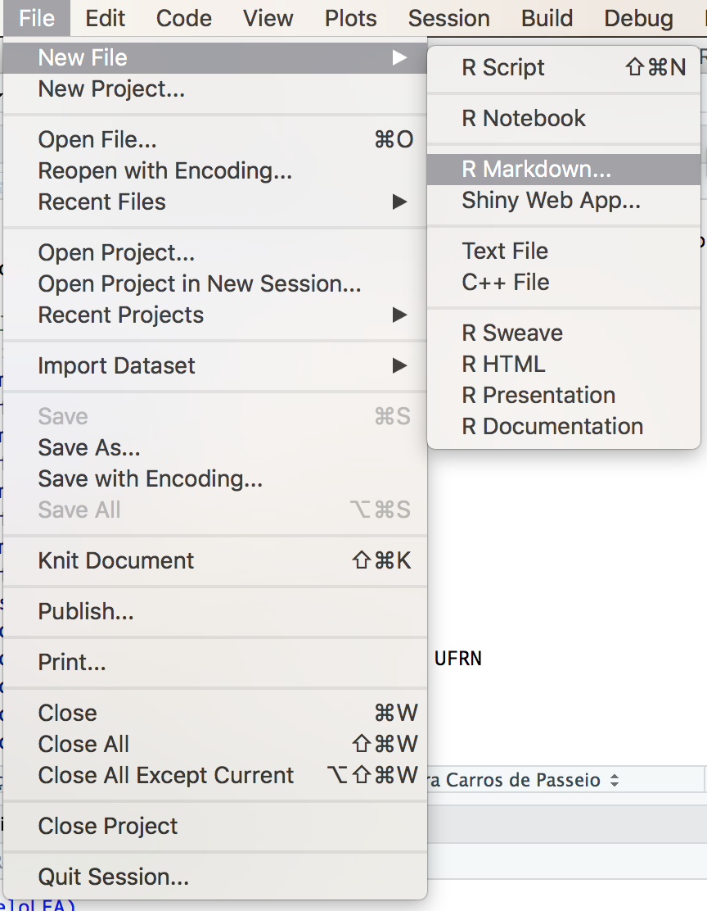
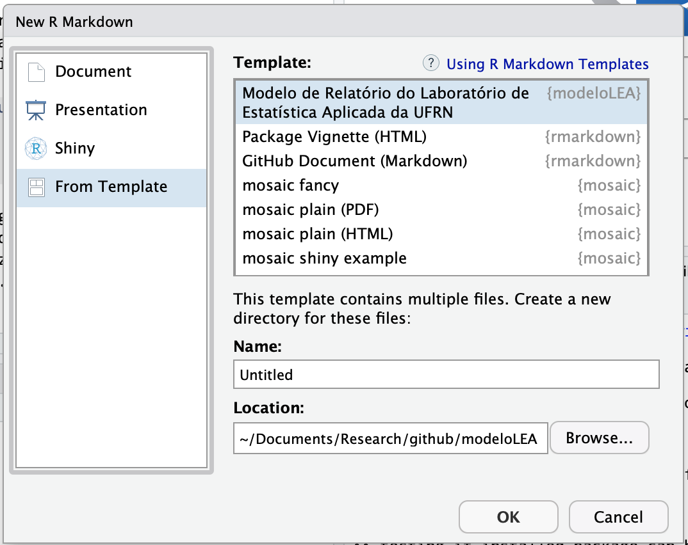

## modeloLEA

Este pacote do `R` utiliza rmarkdown para criar relatórios mesclando `R` e LaTeX. O principal objetivo é unir a análise dos dados à escrita do relatório, fazendo com que o processo de comunicação dos resultados seja mais ágil. 

Além disso, o autor do relatório não precisará se preocupar com a formatação do documento, fazendo com que ele tenha uma tarefa a menos para pensar e deixando todos os relatórios produzidos pelo Laboratório de Estatística Aplicada da UFRN dentro do mesmo padrão visual.

## Requisitos do Sistema

Para rodar os exemplos disponíveis neste repositório, é necessário instalar os seguintes programas em seu computador:

- `R` (versão 3.6.1 ou superior) - [link](https://cran.rstudio.com/)

- RStudio (versão 1.2.1335 ou superior) - [link](https://www.rstudio.com/products/rstudio/download/#download)

- Se o seu computador roda Windows, também é necessário instalar o programa RTool (versão 3.5) - [link](https://cran.r-project.org/bin/windows/Rtools/)

- LaTeX (o MikTeX, versão 2.9 ou superior, versão completa, é o mais usado no Windows. Entretanto, veja abaixo, na Seção _Instalação do LaTeX_, como fazer para instalar uma versão mais simples do LaTeX, a partir do próprio `R`)

É possível que o pacote funcione em outras configurações de software, mas ele foi testado apenas nestas.

Reserve um tempo especial para realizar o procedimento abaixo, pois ele pode demora em torno de 10 minutos para finalizar. Além disso, a compilação do primeiro relatório pode levar até 20 minutos, devido aos pacotes extras do LaTeX que serão baixados automaticamente.

## Instalação dos Pacotes do R

Alguns usuários já reportaram problemas na instalação de algumas dependências do pacote `modeloLEA`. Por isso, antes de começar a instalação do pacote, rode o comando

    options(repos=c(CRAN="http://cran.rstudio.com"))

dentro do RStudio. Isto vai configurar outro servidor do CRAN como o fornecedor de pacotes para a sua instalação. Como o servidor do RStudio está baseado em um serviço na nuvem, a probabilidade dele estar fora do ar é mais baixa do que a de outros servidores, embora, teoricamente, ele seja um pouco mais lento para quem mora no Brasil.

Após configurar o servidor do qual os pacotes serão baixados, rode o comando

    install.packages("devtools")
    
para instalar o pacote `devtools`, responsável pela instalação do pacote `modeloLEA`. Em seguida, execute os comandos

    library(devtools)
    install_github("mnunes/modeloLEA")

para instalar o pacote `modeloLEA`. Se o R Markdown nunca foi utilizado em seu computador, é possível que alguns pacotes extras tenham que ser baixados. Seja paciente.

Embora o pacote já esteja instalado, ele não vai funcionar se não houver uma distribuição do LaTeX em seu computador. A Seção _Instalação do LaTeX_, logo abaixo, mostra como instalar o [TinyTeX](https://yihui.name/tinytex/) na sua máquina. Esta é uma das melhores distribuições de LaTeX atuais, pois vem apenas com o essencial, evitando que bibliotecas de uso muito específico sejam instaladas. Ela foi pensada especialmente para usuários do `R`, de modo que fosse a menor possível e, ainda assim, completa o suficiente para a produção de relatórios de pesquisa.

Perceba que esta é uma versão preliminar do pacote para o modelo de relatório. É possível (bastante provável, na verdade) que hajam alguns bugs. Entre em contato pelo email marcus [arroba] marcusnunes.me para me avisar a respeito de qualquer bug ou problema de instalação ou uso.

O arquivo [modeloLEA_rascunho.pdf](https://github.com/mnunes/modeloLEA/blob/master/documento_final.pdf) exibe o resultado esperado para o relatório final, a ser corrigido pelo orientador e depois entregue ao consulente.

## Instalação do LaTeX

Em vez de instalar o MikTeX em seu computador, sugiro que o [TinyTeX](https://yihui.name/tinytex/) seja instalado. Ele possui uma série de vantagens:

* É mais leve do que o MikTeX
* É baseado no Tex Live, versão do LaTeX que pessoalmente utilizo há mais de 10 anos
* Pode ser instalado de dentro do `R`
* Foi desenvolvido pelo criador do `knitr`, o pacote do `R` utilizado para criar os documentos de forma dinâmica
* Funciona em todas as plataformas (Windows, Linux, macOS)
* A manutenção é mais simples

A instalação do TinyTeX é simples. Se o pacote `devtools` estiver instalado em seu computador, rode os comandos

    library(devtools)
    install_github(c("yihui/tinytex", "rstudio/rmarkdown"))
    tinytex::install_tinytex(force = TRUE)

Vão aparecer um aviso e duas mensagens de erro durante a execução do segundo comando. Ignore-as dando OK no prompt que aparecer e pronto. Após os procedimentos necessários, seu computador vai estar com o LaTeX instalado.

**Feche e abra o RStudio antes de compilar o relatório pela primeira vez.** Ao reabrir o RStudio, rode o comando `tinytex:::is_tinytex()`. Se a resposta for `TRUE`, então o `TinyTex` foi instalado corretamente.

## Utilização do pacote

Após o pacote ser instalado, clique no menu `File > New File > R Markdown...`. Veja na figura abaixo como fazer isto.

Uma tela de diálogo aparecerá. Escolha a opção Modelo LEA (PDF) dentro da guia From Template. Veja na figura abaixo como fazer isto.

Esta sequência de comandos criará uma pasta nova em seu computador. Esta pasta pode ter qualquer nome. No exemplo acima, o nome da pasta criada é `Untitled`. Esta pasta vai conter todos os arquivos necessários para a escrita do relatório de consultoria. Se houver algum problema com os acentos das palavras, vá ao menu `File > Reopen With Encoding...` e escolha a opção Windows 1252.

Basta editar os arquivos `Untitled.Rmd` e `modeloLEA.bib` para produzir seu texto. O arquivo `Untitled.Rmd` contém o relatório em si, enquanto o arquivo `modeloLEA.bib` possui as referências bibliográficas. A compilação do relatório é feita através da combinação de teclas `Ctrl + Shift + K`.

A primeira compilação do relatório será um pouco demorada. A instalação padrão do TinyTeX não possui alguns dos pacotes exigidos pelo modelo do relatório, então tenha paciência. As compilações seguintes serão muito mais rápidas.

Lembre-se que esta é uma versão preliminar deste modelo de relatório. É possível que ainda hajam alguns bugs. Entre em contato pelo email marcus [arroba] marcusnunes.me para me avisar a respeito de qualquer problema.

## Opções do Relatório

Por padrão, a opção `echo=TRUE`, na linha 62 vai exibir o código do `R` utilizado na análise. Quando a versão final do relatório ficar pronta, basta alterar esta opção para `echo=FALSE`, de modo que apenas o resultado do código executado apareça na versão final do relatório.

Após a compilação é gerada uma pasta chamada `Untitled_files`, que contém pdfs de alta resolução de todas as figuras do relatório. Assim, estas figuras podem ser, posteriormente, entregues ao consulente.

Este pacote foi inspirado pelo pacote [rticles](https://github.com/rstudio/rticles). 